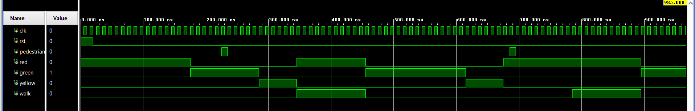

# Traffic-Light-Controller-with-Pedestrian Support
This project implements a Finite State Machine (FSM) for a traffic light controller with pedestrian crossing support.

The design ensures:
Proper traffic sequencing (RED → GREEN → YELLOW → RED)
Safe pedestrian handling using a request latch
No loss of pedestrian input, regardless of when the button is pressed

Key Feautures:
1. State transitions based on current state and input flags.
2. Timer-based state control
3. Latching Logic: Pedestrian requests are captured via an internal latch, ensuring no input is missed regardless of the current light phase.
4. Dynamic Phase Transition:
- Green Phase Interruption: If a pedestrian requests to cross during a green light, the system   transitions to Yellow early after a minimum safety interval.
- Red Phase Shortcut: If a request occurs during a red light, the system transitions directly to the Walk state after a brief safety delay.
  
FSM State Transitions
The controller operates across four primary states:
1. RED: Vehicles stop. System waits for RED_TIME or jumps to WALK if a request is latched.
2. GREEN: Vehicles move. System transitions to YELLOW after GREEN_TIME or earlier if a pedestrian request is detected.
3. YELLOW: Warning phase. Transitions to WALK if a request is active, otherwise returns to RED.
4. WALK: Pedestrian crossing phase. Vehicles see a RED light.

Pedestrian Handling Logic
* Pedestrian input is latched using pedestrian_req.
* Input is never lost, even if pressed during RED or YELLOW.
* Request is served at the earliest safe time.
* Cleared only after WALK state completes.

Testbench Scenarios
- Normal Cycle: The FSM cycles through Red, Green, and Yellow without interruptions.
-  Green Phase Request: Demonstrates the system's ability to "shorten" the vehicle green light to serve a pedestrian.
-  Red Phase Request: Demonstrates an immediate transition to the Walk state (after a safety buffer) when the light is already red.
  
  

Schematic View
The schematic provides a hardware-level view of the FSM. It was generated via Vivado highlights:
- State transition logic
- Register/flip-flop placement
- Combinational & sequential logic blocks
  

Technical Speciications
* Language: Verilog HDL
* Tool: Xilinx Vivado

